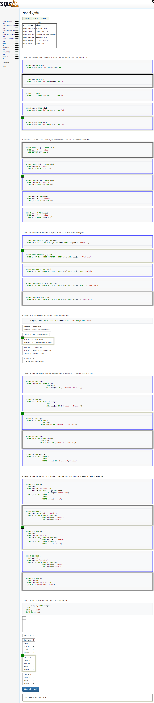

# MySQL

> # This project contains all results of Microverse database's curriculum quiz's.
## Please check this link to see all quiz excercise's here [sqlzoo](https://sqlzoo.net/wiki/SQL_Tutorial)

## Author

👤 **Author**

- Github: [@mcihadkurel](https://github.com/mcihadkurel)
- Twitter: [@mece_ka](https://twitter.com/mece_ka)
- LinkedIn: [@muhammed](https://www.linkedin.com/in/muhammed-cihad-8187581a8/)
